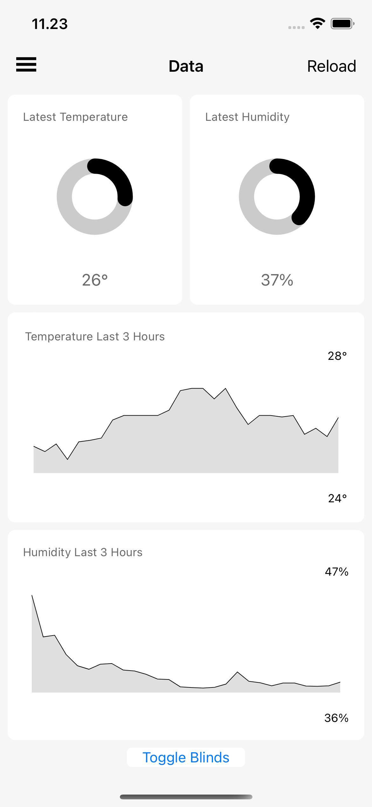

# SmartHome - App
A Xamarin.Forms mobile application that allows for viewing of telemetry data captured by a microcontroller.

## Goals
- [x] Show the latest data points collected.
- [x] Show a graph of data points over a period of time.
- [x] Ability to toggle a servo.
- [x] Built via the MVVM architecture design pattern.
- [x] Ability to show latest data if the internet connection is lost.
- [x] Be able to handle unstable internet connections
- [x] User authentication