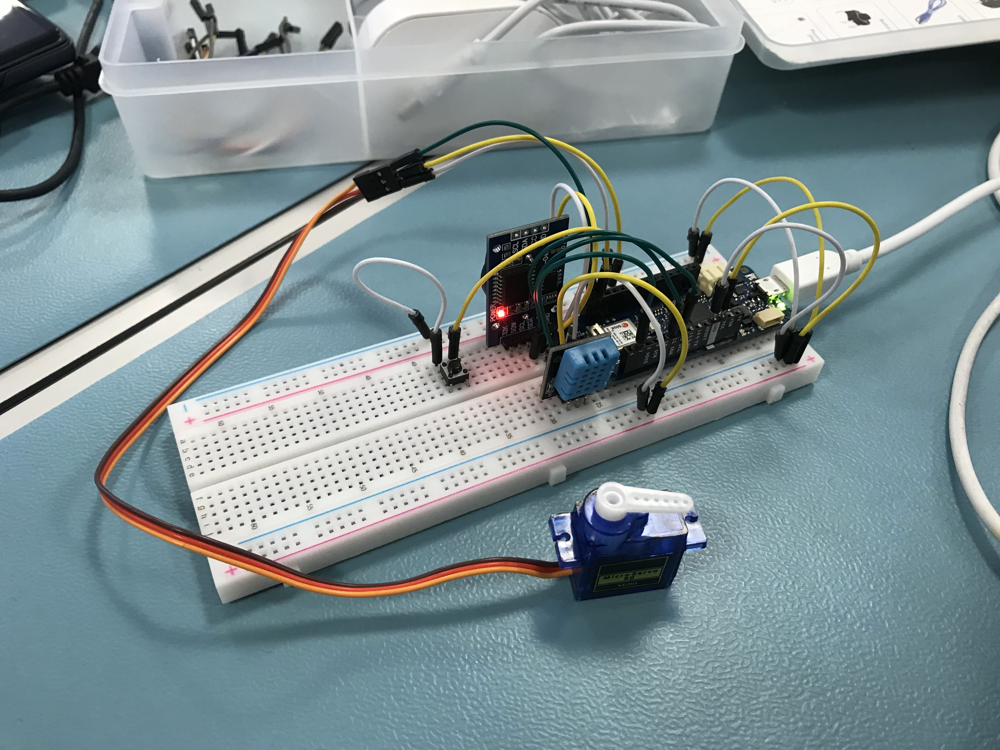

# SmartHome - Controller



This is ***in essence*** a very simple project that allows you to trigger a servo remotely and read a DHT11 sensor, send the gathered data over the internet via the MQTT protocol to a RabbitMQ broker and then storing that data in a InfluxDB database.

# Table of Contents

- [SmartHome - Controller](#smarthome---controller)
- [Table of Contents](#table-of-contents)
- [Concepts](#concepts)
  - [Receivers](#receivers)
  - [Senders](#senders)
- [Goals](#goals)
- [Features](#features)

# Concepts

Here's an overview of the different concepts in this project.

## Receivers
Receivers are functions that get called when a new message is received from the broker for a specific topic.

Receivers always need a topic and a handler function specified. The handler function must be a `void` and must accept a `std::string`.

The receiver must be referenced in the `MQTTManager::configure()` options which is run in the setup function in [main.cpp](/src/main.cpp#L56).

```cpp
// src/receivers/ToggleBlindsReceiver.cpp

#include "ToggleBlindsReceiver.h"

std::string ToggleBlindsReceiver::topic = TOGGLE_BLINDS_RECEIVER_TOPIC;

void ToggleBlindsReceiver::Handle(std::string payload) {
    Serial.println(PrintHelper::ts() + " Payload: " + payload.c_str());
    ServoManager::toggle();
}
```

```cpp
// src/receivers/ToggleBlindsReceiver.h

#include <string>

#include "managers/ServoManager.h"

#include "helpers/PrintHelper.h"

#define TOGGLE_BLINDS_RECEIVER_TOPIC "house/toggle_blinds"

class ToggleBlindsReceiver {
public:
    static std::string topic;

    static void Handle(std::string payload);
};
```


## Senders
Senders are the opposite of receivers, they publish new messages to the broker for a specific topic. The sender takes a command and produces a string that in turn gets published to the broker.

Senders always need a topic and a handler function specified. The handler function must return a `std::string` and accept a `std::shared_ptr<SenderCommandBase>`.

The sender must be referenced in the `MQTTManager::configure()` options which is run in the setup function in [main.cpp](/src/main.cpp#L56).

```cpp
// src/senders/TemperatureSender.cpp

#include "TemperatureSender.h"

std::string TemperatureSender::topic = TEMPERATURE_SENDER_TOPIC;

std::string TemperatureSender::Handle(std::shared_ptr<SenderCommandBase> command) {
    // let's upcast the base command to our specific command
    std::shared_ptr<TemperatureSenderCommand> _command = std::static_pointer_cast<TemperatureSenderCommand>(command);

    // in this case we receive a command with a temperature of type float
    // there is nothing to do, but convert it to a string and ship it off
    return std::to_string(_command->temperature);
}
```

```cpp
// src/senders/TemperatureSender.h

#include <string>
#include <memory>

#include "base/SenderCommandBase.h"

#define TEMPERATURE_SENDER_TOPIC "home/temperature"

struct TemperatureSenderCommand : SenderCommandBase {
    std::string topic() override {
        return TEMPERATURE_SENDER_TOPIC;
    };

    float temperature;
};

class TemperatureSender {
public:
    static std::string topic;

    static std::string Handle(std::shared_ptr<SenderCommandBase> command);
};
```

# Goals
- [x] Reading sensors and sending that data over the internet
- [x] Storing the data for later use
- [x] Ability to trigger different events &mdash; *like opening motorized blinds* &mdash; remotely

# Features
- [x] Continuous collection of temperature
- [x] Continuous collection of relative humidity
- [x] Ability to keep collecting data even if the connection to the internet is dropped and then sending the collected data when the connection has been reestablished
- [x] Event that allows manual opening and closing of motorized blinds *(a servo will be used for demonstration purposes)*
