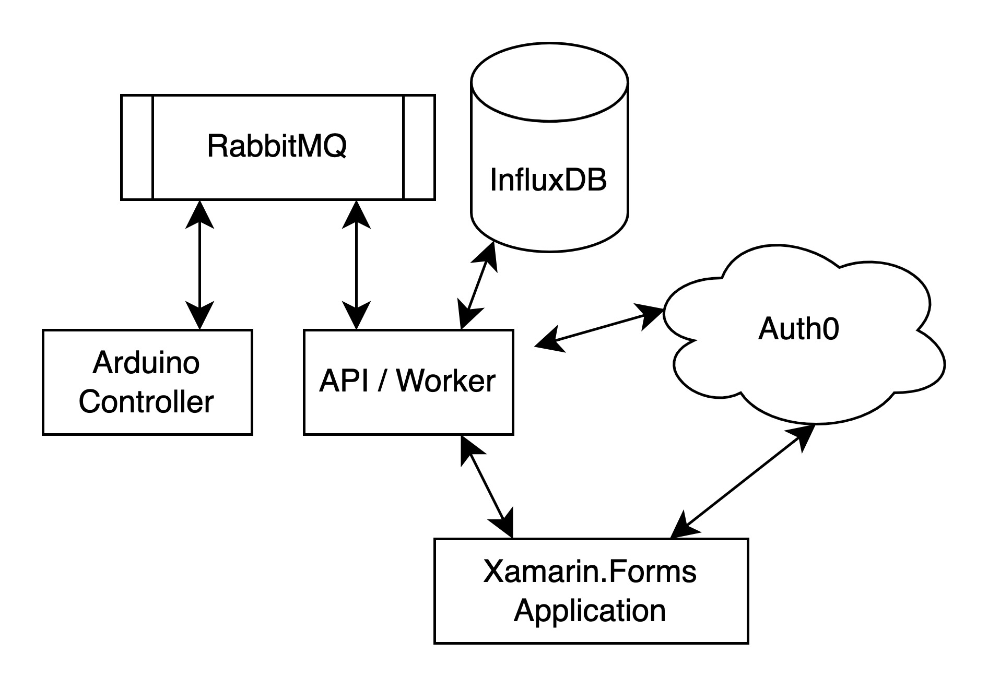

# SmartHome

This is a monolithic repository containing three different projects.

|Name|Description|
|---|---|
|[App](https://github.com/sofusskovgaard/SmartHome/tree/main/App)|A Xamarin.Forms mobile application that allows for viewing of telemetry data captured by the Controller project.|
|[Controller](https://github.com/sofusskovgaard/SmartHome/tree/main/Controller)|An embedded application for a SAMD21 arduino microcontroller|
|[Worker](https://github.com/sofusskovgaard/SmartHome/tree/main/Worker)|Both a service worker and a web API. The worker part of this application consumes telemetry data via RabbitMQ from the Controller project and ingests it into a InfluxDB instance. The web API is used by the mobile application to display telemetry data and toggle a servo on the controller.|
